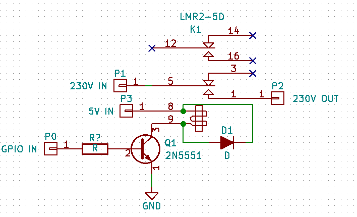
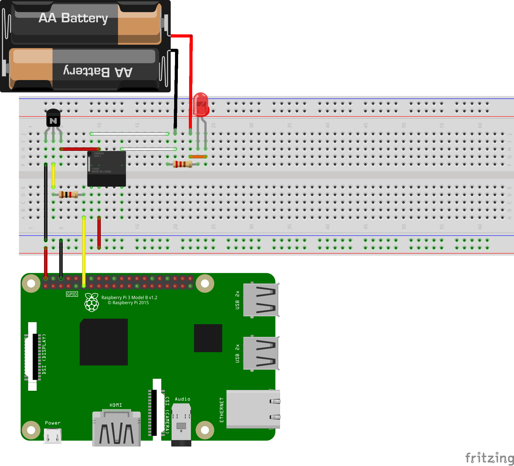

So, you got yourself a Raspberry Pi and were wondering what the hell one could do with all those different pins. You read something about a "relay" - a switch that you can operate with low power to control a circuit with bigger power, and bought one or even two. You sort of looked at the specs of the thing, mostly the "wow, this can relay a 230V voltage!" aspect, and bought two to attach to your Pi. Here's how to make the Raspberry Pi's GPIO ports control it.

**Note: The components I will talk about here have a few attributes relevant to this specific circuit. You can substitute for any equivalent component with the same attributes.**

# Required Knowledge

You should know how to **use a Linux computer and terminal**, **understand basic electronics** (what the components we use _sorta_ do) and **be able to navigate a pin-out** (there's a great site to pick Raspberry Pi pins that we'll control)

# Components

The components I used in this build are:

1. [LMR2-5D](http://www.tme.eu/en/details/lmr2-5d/miniature-electromagnetic-relays/rayex-electronic/) **relay** (electromagnetic DPDT relay, 5V coil voltage, 250VAC/5A contact rating)
2. 2n5551 **NPN bipolar junction** **transistor** (ridiculously overrated for this build)
3. A diode (not a Zener diode!)
4. A breadboard, some breadboard wires and jumper wires for easy Pi interfacing

# Overview

This is what you will do in this build:

1. Learn to build and understand the schematic we'll build
2. Assemble the schematic onto a breadboard
3. Control the Raspberry Pi via a quick **Python script** to trigger the relay

# Schematic

The Raspberry Pi is a tiny computer with a feature that makes it good for electronic builds like this: it includes a set of electronic pins that can be controlled by software for whatever purpose you could think of, called GPIO pins. The pins, when toggled "on" by code running on the Raspberry Pi, will raise their voltage to 3.3V, and when "off", will stay near 0V.

The relay I chose can, however, be controlled by 5V of voltage, which means a mere 3.3V voltage will not be enough to flip the switch. As a happenstance, the Raspberry Pi also includes a "generic 5V power" pin on the set of GPIO pins, which means we can still control the relay if we somehow switch the 5V voltage on and off and direct it to the relay. The end result will be kind of like a switch that closes a circuit to flip the relay that closes another circuit. Like a Russian nesting doll :)

How we would close the 5V circuit is with a transistor. A transistor is like a handle to your kitchen tap - the more current you put on the base, the more current can pass from collector to emitter.

The circuit that controls the relay would look like this:

The circuit has three distinct parts:

1. The transistor - 5V current will pass through the coil of the relay (pins 8 and 9) and will either be blocked or  let through by the transistor (**Q1**).
2. The spike protection - when power is removed from the coil of the relay, the coil will induct the magnetic field around it and produce a spike of current. That can be avoided with a diode connected like **D1** in the schematic.
3. The switch - when the relay is powered on, the pins **P1** and **P2** are connected together.

# Assembly

To assemble this circuit, you need your breadboard. Follow the Fritzing diagram down below.

**Note:** the following image includes a simple AA Battery based LED circuit, that can be controlled by the relay. Replace this with any circuit you want to control.

**Note 2:** the connections on this breadboard were modeled onto a weird Omron relay. For the LMR2-5D, connect the red wires to the coil pins (on the side that has only one set of pins, not three), and one of the white wires to the center (COM for Common), the other to the outside edge (NO for Normally Open).  Make sure to look at [the datasheet](http://www.tme.eu/en/Document/d2ac2b943fe7a9ad43646bec5da8081a/LM-SERIES.pdf) for the locations of these pins.

**Note 3:** the transistor in this image has its pins like this, from left to right: Emitter - Base - Collector. So does the 2n5551. Make sure to place the transistor flat side to the front, like in this image.

# Controlling

Now for the fun part. You get to control the relay with a computer program!

I assume you've gone the beginner route and are using Raspbian or NOOBS as your Raspberry Pi operating system. Those are both based on Debian, which means that the package installing command I will show below will apply to you.

To install the Raspberry Pi Python GPIO library for easy access to GPIO control, run the following command in the Terminal:

    $ sudo apt-get install python-rpi.gpio

If you aren't running Raspbian, then you can either use Pip to install the RPi.GPIO package, or just go for the manual route. The module's [source code is accessible here](https://sourceforge.net/p/raspberry-gpio-python/wiki/install/).

* * *

After you have finished installing the package we need, I'll go straight to the code. This simple program will turn a GPIO pin on and off repeatedly until the end of time.

In a _plain text editor_ (gedit, Atom, Sublime Text, nano and vim, but not a rich text editor like OpenOffice, WordPad or TextEdit), open a new file called _blinker.py**.**_ Copy the following or write it over to the file. I suggest writing it over - lets you read over the code more thorough, and takes more effort :P

#!/usr/bin/env python
# Make functions from RPi.GPIO available in our code - this lets us 
# call GPIO.setup and GPIO.output.
import RPi.GPIO as GPIO

# Make functions from python's time library accessible - this lets us
# call time.sleep to wait for some unit of time. 
import time

# We use the Broadcom pin indexing method. Why there's such a debate on
# the best way to index pins on the Pi, I don't know.
GPIO.setmode(GPIO.BCM)

# Tell the OS that we want to use Pin 17 to send signals to the real
# world.
GPIO.setup(17, GPIO.OUT)

try:
    # Set the pin to about 3.3V (HIGH or 1), wait half a second, 
    # set it to about 0V (LOW or 0), wait half a second, and repeat
    # forever!
    while True:
        GPIO.output(17, 1)
        time.sleep(0.5)
        GPIO.output(17, 0)
        time.sleep(0.5)
except:
    # After any kind of exit, clean all pins that we've setup and make 
    # them reset to default settings.
    GPIO.cleanup()
    exit(0)

Once you've finished (copied the code or written your own), save the script. To run the Python script, we have to use the following shell command:

    $ python blinker.py

You should hear clicks from your relay now - the Pi should be closing and opening the circuit that the relay controls.

**If your relay is working:**

Congrats! You just wired a relay up to a Linux computer. You can now control it however you want, on any purpose! Wire up a 12V LED strip to this, or a desktop fan, or your phone charger.

**If your relay is not working:**

1. With a multimeter, check the voltage between Pin 17 and any Ground pin on the Pi, see if it is changing from 3.3V to 0V and back again. _If yes, the code in your Pi is working normally. Something might be wrong in the circuit._
2. Instead of GPIO Pin 17, connect the 3.3V power pin to the wire leading to the transistor's base. Does the relay make a click now? _If yes, the code in your Pi might not be working normally. It might also mean a loose connection with Pin 17, or a connection to the wrong pin. Check your code, if it has thrown an error you will have to fix it before continuing._
3. Disconnect the relay from the circuit, and hook it up between the 5V and GND pins of the Pi. Make sure not to cross the wires accidentally. Does the relay make a click now? _If yes, the relay works fine. Probably it's the circuit or the code that doesn't work fine._ _If no,_ _check the connections on the relay. If they're connected to the right terminals (so the current passes through the coil), the relay should make a connection. Test with a multimeter - maybe you have a solid state relay._
