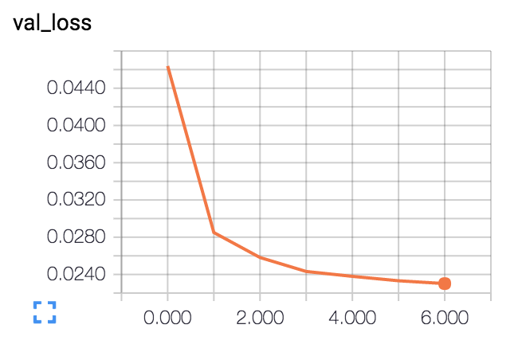
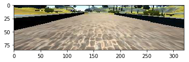
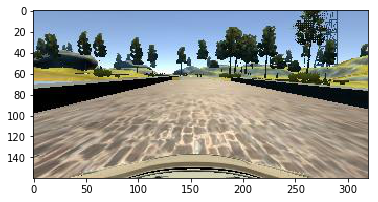

_This one-to-one copy of my writeup for Udacity follows the format in the writeup template, hopefully making the writeup more thorough and easier to grade. It follows a pretty strict format, but includes a lot of interesting content._ 

* * *

**Behavioral Cloning Project**

The goals / steps of this project are the following:

- Use the simulator to collect data of good driving behavior
- Build, a convolution neural network in Keras that predicts steering angles from images
- Train and validate the model with a training and validation set
- Test that the model successfully drives around track one without leaving the road
- Summarize the results with a written report

## Rubric Points

Here I will consider the [rubric points](https://review.udacity.com/#!/rubrics/432/view) individually and describe how I addressed each point in my implementation.

### Files Submitted & Code Quality

#### 1\. Submission includes all required files and can be used to run the simulator in autonomous mode

My project includes the following files:

- model.py containing the script to create and train the model
- drive.py for driving the car in autonomous mode
- model.h5 containing a trained convolution neural network
- writeup\_report.md or writeup\_report.pdf summarizing the results
- video.mp4 showing the car driving

#### 2\. Submission includes functional code

Make sure you have similar versions of the following packages:

- Keras 2.0.1
- Python 3.5.2
- TensorFlow 0.12.1
- OpenCV 3.1.0
- Scikit Learn 0.18.1
- Numpy 1.12.0

Using the Udacity provided simulator and my drive.py file, the car can be driven autonomously around the track by executing:

python3 drive.py ./model.h5

#### 3\. Submission code is usable and readable

The training script model.py defines the model and runs it against the recorded data. After training, it saves the model into a file named "./model.h5". It also saves checkpoints after every epoch as well as TensorBoard data.

### Model Architecture and Training Strategy

#### 1\. An appropriate model architecture has been employed

The model architecture consists of a modification of LeNet with deeper convolutional layers and a few applications of dropout.

The layer architecture is as follows:

| Layer | Layer Kind | Size | Stride | Kernel Count | Padding |
| --- | --- | --- | --- | --- | --- |
| 1 | Convolution2D | (5, 5) | (1, 1) | 20 | Same |
| 2 | ReLU |  |  |  |  |
| 3 | MaxPooling2D | (2, 2) | (2, 2) |  | Valid |
| 4 | Convolution2D | (5, 5) | (1, 1) | 50 | Same |
| 5 | ReLU |  |  |  |  |
| 6 | MaxPooling2D | (2, 2) | (2, 2) |  | Valid |
| 6 | Convolution2D | (3, 3) | (1, 1) | 70 | Same |
| 7 | ReLU |  |  |  |  |
| 8 | MaxPooling2D | (4, 4) | (1, 1) |  | Valid |
| 9 | Flatten |  |  |  |  |
| 10 | Dense | 120 |  |  |  |
| 11 | ReLU |  |  |  |  |
| 12 | Dropout | 0.5 |  |  |  |
| 13 | Dense | 84 |  |  |  |
| 14 | ReLU |  |  |  |  |
| 15 | Dropout | 0.5 |  |  |  |
| 16 | Dense | 1 |  |  |  |

#### 2\. Attempts to reduce overfitting in the model

The model contains dropout layers in order to reduce overfitting (Layers 12 and 15, lines 158 and 161 in the source code). As well as that, the data is shuffled after every epoch and augmented with multiple methods.

#### 3\. Model parameter tuning

The only hyperparameter to tune while improving the model was the left-right steering offset when using left or right images. After experimenting, I left it at 0.25.

The learning rate was automatically scaled using the Adam optimizer.

#### 4\. Appropriate training data

I used Udacity training data to learn for Track 1, and my own recordings for Track 2. I augmented the training data by using left-right images to allow recovery learning and by flipping the image horizontally.

### Model Architecture and Training Strategy

#### 1\. Solution Design Approach

The model architecture was designed iteratively, but held back a lot by my issues with the "plumbing" of loading images into the model while training or driving. After a rewrite to a simpler LeNet-like approach, I achieved smaller losses and better performance on the road.

The neural net had to be convolutional, due to the convolutional network's power in detecting image features such as shapes of lanes or the curvature of the road. I used three layers of convolutions to allow the model to build a higher understanding of what it "sees", as well as a few fully connected layers for regression learning.

The model's image data was split into a training and validation set using Scikit Learn and run through a batch generator when actually training.

In my first few approaches, the model was training well (often reaching up to 50% accuracy) but validating badly and driving horribly. This indicated an overfit as well as issues with the pipeline.

After a rewrite, the model was simple enough again to run on my laptop and train within reasonable time. The first iteration after the rewrite got past the "curve" and fell off the road right after, indicating issues with data selection (seems like it only used the first ~1000 frames to train).

After shuffling the data properly and improving the data pipeline, the training accuracy improved but the model was still doing badly in curves and on the bridge.

I added another convolutional layer to improve with higher-level feature detection, and after that, the model's performance improved by a lot.

The vehicle's driving behavior with the new model was far better, going around the track after training with just 1000 frames. I increased the size of the dataset and trained again, which improved the behaviour even more.

As an experiment, I also recorded data on Track 2 and trained an individual model on those frames alone. The model's behaviour on Track 2 was impressive and it circumnavigated the track on the first try, however did not stay in the right lane all the time (often cutting around corners in the other lane).

At the end of the process, the vehicle is able to drive autonomously around Track 1 without leaving the road. Around Track 2, performance is still somewhat spotty, but it manages to drive far better than I assumed.

Here's some stats about the trained model.

Model loss over epochs:

Model validation loss over epochs:

Model validation accuracy over epochs:

#### 2\. Final Model Architecture

The final model architecture is described in the table above as well as in the code (model.py lines 144-163).

Here's a TensorBoard visualization of the model. (It didn't want to let me download a full-size PNG, so it is a screenshot)

#### 3\. Creation of the Training Set & Training Process

The training dataset I used to train Track 1 was from Udacity itself. The Track 2 data I recorded myself.

I recorded two laps of Track 2 data, trying to drive as smoothly as possible, but failing and recovering due to the complexity of the track. This might be beneficial in order to allow the network to learn recovering on its own even more.

During runtime, the dataset was normalized and preprocessed like this:

1. Load an image by randomly taking either the left, right or center image and offsetting the steering angle as necessary.
2. Crop the image by removing the top 50 and bottom 25 pixels. `image = image[ 50 : image.shape[0] - 25, :]` 
3. Transform the image's color space from BGR to RGB. (For fun, here's a HSV image where the plotter assumes it's RGB.) 
4. Resize the image to 64x64x3 using inter-area interpolation. 
5. Normalize the image data using `image = image / 255.0 - 0.5`
6. On a coin flip, decide to horizontally flip the image or pass it as-is to the model.

The source code for it can be found in model.py lines 63-104.

## Short Data Analysis

The model data consists of 8036 entries and a total of 24108 images.

Here's some base parameters of the data:

The steering angles are distributed as follows. Note how much the Udacity data biases zero steering over any other angle. Seems like it was gathered while driving with the keyboard. However, this doesn't affect my model, so I haven't taken action to reduce its occurrence in the training set.

The data consists of 160x320 images that look like this:

After preprocessing, the images look like this:

Steering angles over time look like this:

