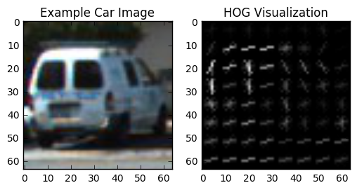
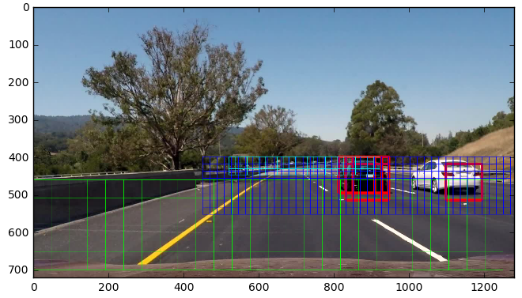
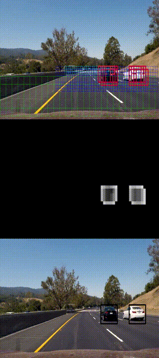
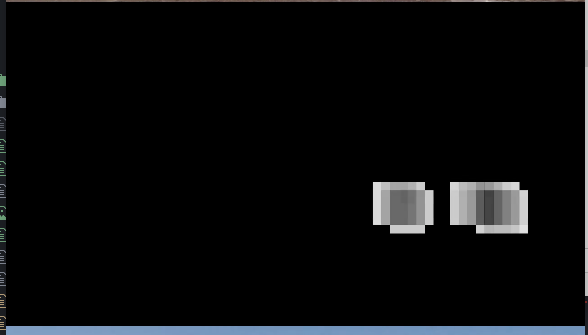

# Vehicle Detection Project\*\*

This is a writeup for my Vehicle Detection project.

## Goals

The goals / steps of this project are the following:

- Perform a Histogram of Oriented Gradients (HOG) feature extraction on a labeled training set of images and train a classifier Linear SVM classifier
- Optionally, you can also apply a color transform and append binned color features, as well as histograms of color, to your HOG feature vector.
- Note: for those first two steps don't forget to normalize your features and randomize a selection for training and testing.
- Implement a sliding-window technique and use your trained classifier to search for vehicles in images.
- Run your pipeline on a video stream (start with the test\_video.mp4 and later implement on full project\_video.mp4) and create a heat map of recurring detections frame by frame to reject outliers and follow detected vehicles.
- Estimate a bounding box for vehicles detected.

## Rubric Points

Here I will consider the rubric points individually and describe how I addressed each point in my implementation.

### Writeup / README

Woo, I did it! I was so worried I would not complete this project in time. Have fun with reading it :)

### Histogram of Oriented Gradients (HOG)

#### 1\. Explain how (and identify where in your code) you extracted HOG features from the training images.

I extracted HOG features from the training images in the classification phase, and during sliding window search in the search phase.

I created a function to extract HOG features in lesson\_functions.py lines 6-23. It has a mode of outputting with visualization or without, and will default to compacting the HOG features into a feature vector.

When testing, I explored HOG parameters using Proto2.ipynb. What worked best for me was a conversion to YCrCb and running HOG with 9 orientations, 8 pixels per cell and 2 cells per block.

Here's an example of HOG while testing:

#### 2\. Explain how you settled on your final choice of HOG parameters.

After trying various combinations of HOG parameters, a cell size of 8 seemed to be most stable to varying car conditions. I didn't see much improvement when changing the orientation count from the originally selected 9, so I left it at that.

What improved my model performance the most was using all YCbCr channels for HOG.

#### 3\. Describe how (and identify where in your code) you trained a classifier using your selected HOG features (and color features if you used them).

I trained a classifier in the classification phase in `classifier.py` lines 73-76.

I used the ScikitLearn library LinearSVM with the C parameter equal to 0.1. The C parameter was reduced to minimize false positives while providing a stable and general result.

The image pipeline used all available features learned in the lessons preceding the project: spatial and histogram features next to HOG. These provided a high combined accuracy.

I trained the classifier over 8792 cars and 8968 cars, performing no data augmentation or collecting additional data.

I ended up with a feature size of 8460 numbers per image. The SVC trained for 15 seconds and has 99.01% test accuracy.

Test Accuracy of SVC = 0.9901

### Sliding Window Search

#### 1\. Describe how (and identify where in your code) you implemented a sliding window search. How did you decide what scales to search and how much to overlap windows?

I implemented a sliding window search method in the search phase, in `lesson_functions.py` lines 199-227. I then implemented the search function in `vehicledetector.py` lines 31-46 (lines 46-67 are the heatmapping function) to search over 3 scales, specifying overlap and sizes.

I specified my search scales in terms of a "window size" hyperparameter called `WS` which is 32px. My smallest scale was WS x WS, the medium scale was 3 \* WS x 3 \* WS, and the largest scale was 6 \* WS x 6 \* WS. Note all hyperparameters have been pulled to hyperparameters.py.

For window overlap, I tested multiple times with varying results. I got the best results with a lot of overlap, since bigger windows would then be able to more closely approximate the car's bounding box. I ended up using 80% overlap for my large scale, 75% overlap for the medium scale and 50% overlap for the small scale.

Here's a table with all the scales:

| Scale | Size | Overlap |
| --- | --- | --- |
| Large | 192x192 | 80% |
| Medium | 96x96 | 75% |
| Small | 32x32 | 50% |

I also selected start/stop coordinates for the windows to prevent them from scanning areas that cars of relevant size will not appear.

Here's an image of windows (cyan = small, blue = medium, green = large), with red squares marking live detections:

#### 2\. Show some examples of test images to demonstrate how your pipeline is working. What did you do to optimize the performance of your classifier?

Here's a test-mode video that shows a three panel image with parts of the pipeline:

The top image shows **windows** and **red where cars were detected this time**. The middle image shows a **heatmap** of car images found, useful for stripping out abnormal detections and keeping track of moving cars. The bottom image shows a **final footage** of boxed detected cars.

## 

### Video Implementation

#### 1\. Provide a link to your final video output. Your pipeline should perform reasonably well on the entire project video (somewhat wobbly or unstable bounding boxes are ok as long as you are identifying the vehicles most of the time with minimal false positives.)

The end pipeline performs pretty well on the project video, creating bounding boxes that approximate the shape of the car. However, it can be improved with more relaxed thresholds and more windows in the medium and large scale.

https://youtu.be/QQjuP2hzYSI

#### 2\. Describe how (and identify where in your code) you implemented some kind of filter for false positives and some method for combining overlapping bounding boxes.

To filter for false positives, I spent a lot of time tuning the processing and messing with classifier parameters to provide the least possible false positives.

After all that was done, I implemented a heatmap by mapping windows over multiple frames and thresholding the map to create a map of vehicle positions.

This heatmap and labelling is done in vehicledetector.py lines 48-65.

I then used `scipy.ndimage.measurements.label` to identify blobs in the heatmap and assign them to a vehicle. After that, I constructed bounding boxes surrounding the blobs.

The heatmap is visible on the test video as well, but here's a screenshot:

### Discussion

#### 1\. Briefly discuss any problems / issues you faced in your implementation of this project.

**Where will your pipeline likely fail? What could you do to make it more robust?**

When I was implementing this project, I had a lot of [trouble isolating false positives](https://github.com/boxmein/CarND-Vehicle-Detection/blob/master/Prototype%20Videos/1493150619.582245_test_video.mp4) from road shadows. What helped me most here was running the classifier on the entire dataset, giving it a much better understanding of the difference between road and car.

I also had some trouble detecting the white car. Perhaps this is because of the dataset, as white cars are less common than other colors and this might have thrown the color histogram function off.

As well as that, I did not know where to start - I didn't have a mental roadmap in front of me, of which part to implement first and which second.

My pipeline will likely fail on roads that go outside the window area (ie, slopes or hills, as well as steeper curves and intersections). For these to work, the classifier needs to be trained more thoroughly and the image pipeline improved. There should be more windows in a larger area.

My pipeline may not generalize too well to different conditions - I didn't augment the data with brightness or translation adjustments as well as more non-road imagery. This means that the classifier might work best on a clear day.

Thank you for reading this writeup!
