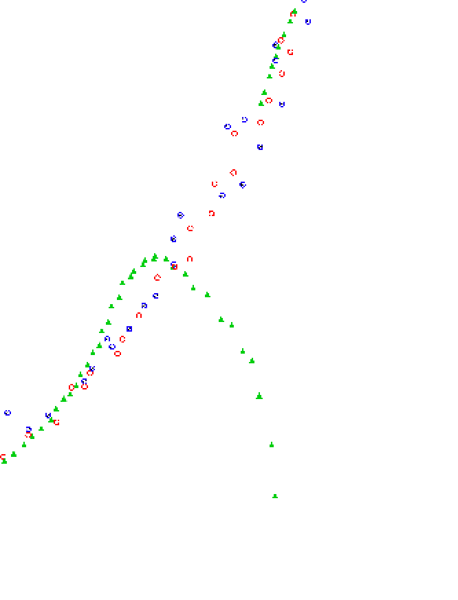

This is a discussion of how I solved the Extended Kalman Filters project in the Udacity Self-Driving Car Engineer Nanodegree.

## The problem

Our car has two sensors: a lidar and a radar. Both can see a pedestrian. Based on the lidar and radar data (both a bit noisy), keep track of the pedestrian's position and velocity.

## The solution

Kalman filters offer a solution that can combine both lidar and radar data to complement each other, and a robust object-tracking model that also keeps track of the error margins.

## The project

We had a sample code project available for download, which had to be filled in with a number of different tasks. We had to:

- Initialize matrices for both the laser & radar sensors
- Upon first measurement, initialize our object's state, keeping in mind that radar and lidar data has to be initialized a bit different
- Calculating the pedestrian's next predicted position
- Comparing the predicted position with their measured position, and updating our estimations (state) appropriately, keeping in mind that radar and lidar data will have to be updated differently
- Calculating the Root Mean Squared Error between the pedestrian's estimated position and their real (ground-truth) position.

## Matrix initialization

Initializing the Kalman filter state was a matter of setting up the correct matrices (measurement noise of both the radar and lidar sensors, as well as the matrices relating our state to the measurement).

The matrices for both the radar and lidar sensors depend on the actual characteristics of the device, so in essence they were provided. Just needed to use Eigen's comma initializers and fill them in.

## State initialization

Initializing the object's state has two different approaches, depending on if we start with lidar or radar data.

If we keep track of the pedestrian as a 4-vector (X, Y, X-velocity, Y-velocity), the lidar data will immediately give us a X & Y coordinate for the pedestrian, but no velocity data at all.

The radar data will however give us a distance and an angle (from the X-axis if the X axis was parallel to and towards the front of the car). From there, we can simply translate the polar coordinates (rho & phi) to Cartesian coordinates (X & Y). We won't use the radar's velocity data to initialize the matrix for now.

The initialization data will result in a velocity value of zero, which prevents calculating the Jacobian matrix for the radar update step. You can say instead that the velocities are near-zero instead, something like 0.0001, which will allow the Jacobian calculation to not fail.

## Prediction

When the pedestrian moves, the sensors will constantly feed us with timely data of where the pedestrian is. However, this data isn't perfect and has defined error margins that can be taken into account when estimating the pedestrian's position.

Our prediction step will then run before each update step, and output the next possible positions and velocities for us to compare later. As well as that, it will change the uncertainty matrices to indicate that a prediction causes larger uncertainty in the pedestrian position.

## Update

After the prediction is processed, we're ready to use the measurement to update our understanding of the pedestrian's position (px, py). The measurement will be integrated into the state by a weighted average (with the prediction's and measurement's covariance P and Q) and the new state x' (px, py, vx, vy) will reflect the pedestrian's position more accurately.

In the case of lidar, we can simply use the X & Y data to compare the measurement and state. Since the state keeps track of the velocity, we need to discard the velocities before subtracting to find the error, by multiplying with the H matrix. Then the error can be used to correct the positions, magically determine the velocities and also update the uncertainty matrices.

In the case of radar, we can't subtract X & Y from the radar's rho, phi and rho-dot values, but we can transform the state into a rho, phi and rho-dot vector, and then subtract from the measurement. This transformation is done by the h(x') function. After the comparison, a slightly different method can be used to correct positions and velocities and update the uncertainty matrices.

**Note:** In the case of radar, after we subtract the measurement's rho, phi and rho-dot values from the state rho, phi and rho-dot values, we have to be careful to constrain phi between -pi and pi. This can be done by repeated addition / subtraction of 2pi to/from phi. I forgot to do this and had this specific issue with my predictions veering off (red = lidar, blue = radar, green = predicted position)

## Rubric

To pass the project, the following guidelines must be followed:

1. **The code must compile** It does!
2. **RMSE must be: px < 0.11, py < 0.11, vx < 0.52, vy < 0.52** I have the following RMSE values: px = 0.097, py = 0.085, vx = 0.45, vy = 0.43
3. **The first measurement should be a special case & initialize lidar and radar correctly** Done
4. **Processing flow matches the flow in the lessons** Yep
5. **Prediction step is before the update** Check
6. **Filter can handle both lidar and radar measurements** Yass
7. **Code Smell: repeated calculations have been pulled into variables for reuse** Repeated calculations have been avoided all across the project in matrix initializers
8. **Code Smell: over-running loops** Loops are all run conditionally with carefully checked conditions
9. **Code Smell: unnecessary data structures** Just using the project structure avoids that
10. **Code Smell: Unnecessary control flow checks** I have a double check for the Phi adjustment in the EKF update function, but other than that there's no double-checks.

## Summary

The project was an interesting one and having so much to do for yourself in code really made me feel like I built the entire "thing" up myself. It's a stark difference from, for example, the Miniflow project, where most of the code was simply copy-pasting from the lecture video/materials. However, what I got stuck most on was the matrix math behind the filter, which I didn't intuitively end up understanding after all. I however can now apply the Kalman filter and know approximately what each matrix does. I guess that's good enough for now.
