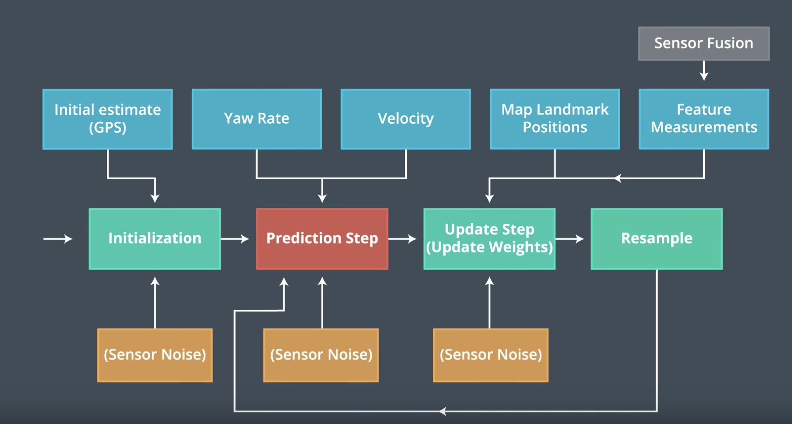
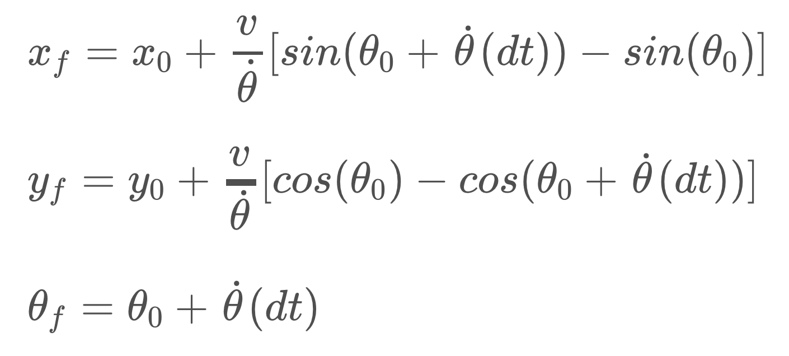
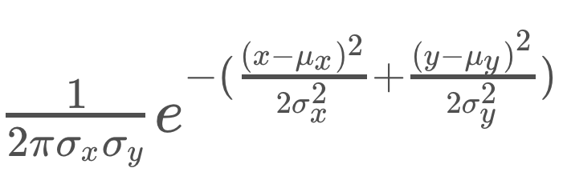

This is a discussion on how I implemented and finished the Particle Filters project in the Udacity Self-Driving Car Engineer Nanodegree.

### The challenge

Given a map of the world (a bunch of landmarks), and the car drawing lines to all landmarks within range with noisy data, give the best assumption for the car's position in the world.

### The process

How I was going to solve it was with an approach called **particle filters**. It essentially throws many "cars" into the world, and sees which fit the landmark measurements the best, eliminating the worst "cars" by weighted sampling.

We assume the car moves like a **bicycle**:

- The two front wheels move and rotate as one
- The two back wheels move as one
- The front and back wheels are constantly distanced from each other.
- This means we are using a **constant turn rate & velocity** model - CTRV for short.
- Note that in the real world, cars don't have constant turn rate and velocity, but we can correct the particle's velocity and turn rate as we go along. In the span of ~10 ms, we can assume the model to be close enough to the real world.

This will help us in the future, making the particles follow the car.

We use the Udacity Term-2 Simulator to provide us with car sensor data, and load a world map from a file.

Here's what our program will look like as a flowchart. Various data / information used in each step are shown in blue. Places where we have to manually introduce noise into our model to account for an uncertain representation are shown in blue.

### Initialization

In initialization, we have to create many particles that are, in essence, random guesses to where the car may be and what way it is heading. However, to start off, we can use a coarse estimate such as a GPS reading to place our particles more efficiently.

We initialize a set of 80 particles, each with a randomly drawn X, Y and angle, from a multivariate normal distribution centered on the GPS reading and with a standard deviation of 5 meters.

### Prediction

In the prediction step, we move all particles according to how the car moved. What we know from the car's internal metrics is the velocity, delta-time, and the yaw rate, so we have to use our motion model to find new X/Y positions and heading for every particle.

Here we also add some random noise to each value, because the velocity & yaw rate sensors may not be too accurate. More precisely, we know upfront what noise values we should use for the X, Y and yaw values.

Here's the equations I used to implement the bicycle motion model:

where xf, yf and theta-f are the posterior X, Y and yaw values, in m, x0, y0 and theta-0 are the prior X, Y and yaw values, in m, v is the velocity of the car, in m/s, theta-dot is the yaw rate of the car, in rad/s^2, and dt is the delta-time in seconds.

### Update

In the update step, we weigh all particles by how accurately they match the measurements.

For this, we first take all the car's measurements (in relative coordinates - where the car is the origin, the X axis points toward the front, and the Y axis toward the left), and translate them to global coordinates. This is achieved by essentially translating and rotating a vector. You will be able to find an equation [online](https://www.willamette.edu/~gorr/classes/GeneralGraphics/Transforms/transforms2d.htm) for that.

After that, we find all landmarks that are in sensor range of the particle - simply find the distance between the particle and each landmark and threshold by sensor range. This gives us a list of _predicted_ landmarks. (Since we are trying to predict which landmarks the car sees)

Thirdly, for each measurement, we find the nearest _predicted_ landmark to each translated measurement _(observation)._ This is a simple minimum distance algorithm (nearest neighbor). We keep track of each measurement's nearest landmark.

**Note to self:** in this project, each landmark is indexed starting from 1, but are loaded into an array starting from 0. This means **the landmark with the ID 1 will be in the landmark list at position 0.**

Fourth, we will find the distance between each measurement and landmark, and find the multivariate Gaussian distribution value according to those distances. Each measurement's weights will be multiplied together and the resulting weight will be the particle's weight. (The bigger the weight, the more accurate this particle is)

Here's the reduced-case algorithm that gives us the weight of one measurement, assuming a few things:

- A two-dimensional world (x, y)
- A uniform **non-correlated noise** for x and y measurements

where x, y are the landmark's global coordinates in m, µx and µy are the measurement's global coordinates in m, and σx and σy are the measurement's x and y standard deviations in m.

Reinitialize a particle's weight to 1, and for each measurement, simply multiply the value of the equation above onto the particle's weight.

After the update, we will collect all the particles' weights into a vector for the resampling step.

#### Bonus Step - Particle Associations & Blue Rays

The Udacity Simulator supports an extra set of data - each particle's transformed measurement list. If you enable this, you will get fancy blue rays pointing to your best particle's observations.

To implement this:

1. For each measurement/_observation_ in the translated vector of measurements (in global coordinates for this particle):
2. Add the measurement's ID to the particle.associations vector
3. Add the measurement's X to the particle.sense\_x vector
4. Add the measurement's Y to the particle.sense\_y vector

### Resampling

After we know each particle's weight, we have to redraw a new set of particles. In this step, it is expected that multiple copies of one particle will survive in the new set.

The simplest way to do it is to use the C++ builtin std::discrete\_distribution. To create it, pass it an array of weights (in vector form). It will then return integers from 0 to the length of the array according to their weights. This is ideal in our case, since we need indices to pick particles from our existing array.

std::discrete\_distribution particleDist(weights.begin(), weights.end());

After the resampling is done, we will have a new list of particles where there's proportionally more particles with a higher weight, and some very low-weighted particles may even disappear.

**Note to self: the discrete\_distribution constructor doesn't take vectors, but it takes start and end iterators, which are easy to get from a vector.**

After the resample step, the code will go back to the prediction step. This is it!

### Conclusion

This project was a lot of fun, and easy to implement. I spent around ~10 hours on it, plus a few lost strands of hair.

What made the project hard for me is the fact that the simulator only shows the best particle, so if your weighting function is buggy and causing all particles to have zero weight, it always shows the first.

Additionally, I didn't know how to implement the sense/association data and I had to figure it out manually.

Lastly, the errors I had were caused by a simple off-by-one error. The landmark id-s start from 1, but I was using the landmark id-s to index the landmarks array, sometimes causing segfaults and most of the time causing the car to veer off tremendously.

A judicious use of the LLDB debugger, and verbose logging helped me a lot to find those last few bugs.
