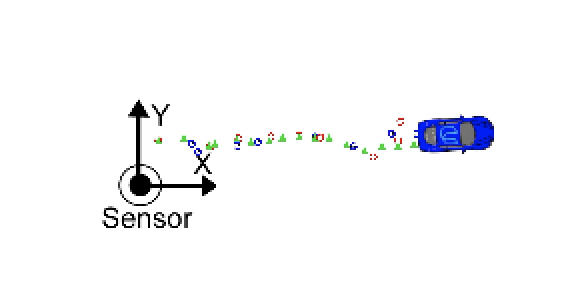

This post is about the [Unscented Kalman Filters project](https://github.com/boxmein/CarND-Unscented-Kalman-Filter-Project). Unscented Kalman Filters are like a Level 2 version of [Extended Kalman Filters](https://wsdf294.wordpress.com/2017/06/04/using-extended-kalman-filters-for-object-tracking/).

When my code (hopefully) passes review, I've finished Term 2 of the Nanodegree. (I've been pushing forward for 7 months even though it feels like I just applied to enter the Nanodegree!)

Here's a video of the Unscented Kalman Filter doing what it's supposed to.

The red and blue dots are noisy sensor data, while the green dots are the Kalman filter deciding the car is somewhere in the middle of the sensor data.

https://www.youtube.com/watch?v=nTTJY56KR1I

 

## Unscented Kalman Filter

The [Kalman Filter](https://en.wikipedia.org/wiki/Kalman_filter) is a method of estimating unknown variables, given imprecise measurements of those variables over time. It consists of witchcraft relating to Gaussian distributions, which results in finding truth from statistical noise.

In our assignment, we have to estimate the location of a car that is traveling in a figure-8 around the origin. In the simulator, there's a blue car spewing blue and red dots behind it - those are radar and lidar measurements, respectively.

We also know that the car's sensors aren't perfect, and we read the datasheets to find the errors of both sensors. For example, the lidar's error is +/- 15 cm on the X and Y axis. For the lidar, it's +/- 30cm for range, and +/- 0.3 rad for bearing. The Kalman filter will take those into account.

We've already worked with Extended Kalman Filters, and the ugly hack with Jacobians to get the equations to fit into a linear mapping makes the EKF stink. The Unscented Kalman Filter has a better approach.

## Difference with EKF

The UKF is actually a modification of the [Extended Kalman Filter](https://wsdf294.wordpress.com/2017/06/04/using-extended-kalman-filters-for-object-tracking/), with the property that it accepts nonlinear state space transformations. Instead of trying to linearize the transformation with approximations, we can approximate the Gaussian distribution by taking a number of samples around our last prediction and performing the rest of the Kalman filter according to their mean.

## Summary

The UKF project was the hardest of Term 2 for me. I finished the implementation before the soft deadline, but got stuck with a specific bug that froze the entire car after ~50 steps. With further digging for hours over the last few days, it turns out the state accumulates a really large turn rate. (To the tune of _2475671053860982691529977328824547267667523360841907602375247356361884070250956993566994344195776169297284982224684070269112727633920.0000_)

This in turn affects the yaw, which affects the angles used for X and Y coordinates.

Here's all the different bugs I had to fix before getting a sane result from the UKF.

When predicting the next state:

- Using the **wrong $latex \\sqrt{\\lambda+n}$ expression**: here $latex \\lambda = -4$ and $latex n\_{aug} = 7$, resulting in $latex \\sqrt{3}$.
- Forgetting to reset the **Xsig\_pred\_** to zeros.
- Not noticing differences inside the **offset calculations** if $latex \\dot{\\psi} \\approx 0$

When updating states based on new measurements:

- Not **normalizing the angle(s)** when finding Lidar or Radar measurement covariance and cross-correlation matrix
- **Subtracting instead of adding** from P\_.

In the end, I had a lot of fun writing this. It was really satisfying to finally see my RMSE below the max allowed RMSE.

This concludes my Term 2 of the Nanodegree. I can't wait for Term 3!

Here's the [source code.](https://github.com/boxmein/CarND-Unscented-Kalman-Filter-Project)
