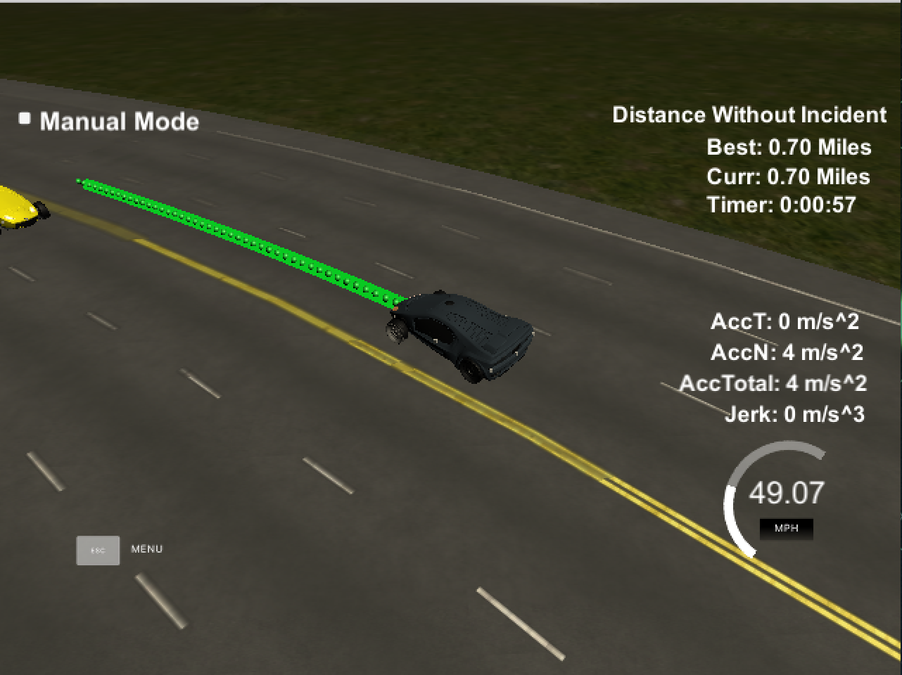

This is a writeup of the Self-Driving Car Engineer Nanodegree Term 3 **Path Planning** project. It was very challenging to say the least, but with the approach presented in the walkthrough, I quickly made headway. It also outlined important implementation details such as working relative to the end of the path instead of the car, and reusing path points from previous iterations of the simulator.

[Check out my source code.](https://github.com/boxmein/CarND-Path-Planning-Project)

The simulator is very helpful for the particular project, since it calculates which points were used and unused automatically.

# Rubric Points

Here's an overview of the rubric points that I need to comply with in order to meet requirements.

## 4.32 miles without incident

The car drove a total of 28 miles without incident when testing, and then I closed it because it had not failed in 40 minutes. Incidents include going faster than the speed limit, coasting in between two lanes or driving off the road or in the oncoming lane. As well as that, collisions with other cars, or violent acceleration and change in acceleration (jerk) will cause an incident. The car is allowed to stay in between two lanes for up to 3 seconds while changing the lane.

## According to the speed limit

_The car cannot exceed the speed limit nor obstruct traffic._

A safe setpoint to approach the speed limit of 50mph while not exceeding it is 49.5 mph.

## With low acceleration and jerk

_The car cannot exceed the maximum acceleration of 10 m/s^2, nor the maximum jerk of 10 m/s^3._

My code achieves that by planning long ahead and using cubic splines to smooth the trajectory between two lanes. Additionally, the car is only allowed to accelerate a maximum of 1 m/s^2 per 200ms.

## Without collisions

_The car cannot collide with other cars._

This can be implemented by checking for safety at two risky maneuvers: keeping lane while close to another car, or while swapping lanes.

When the car is keeping lane, it will automatically keep at a distance with the car in the front.

When the car is swapping lanes, it makes extra sure there are no cars in the lane in a 12m range behind and in front of the target trajectory.

## [](https://github.com/boxmein/CarND-Path-Planning-Project/blob/master/WRITEUP.md#staying-in-its-lane-except-when-changing-lanes)Staying in its lane, except when changing lanes

_The car must not coast in between lanes for too long._

This incident comes up when the car has one of two errors: either the car keeps lane incorrectly, or the car doesn't finish a lane switch before starting a new one, causing it to interpolate its position to exactly between two lanes.

The first problem can be solved by hand-calculating the desired D value for every target position from the target lane: since we know for sure each lane is 4 meters wide, and the D origin is on the road's center line, we can find the lane's center by multiplying the lane number (from 0) by 4 and adding 2. For example:

```
f(lane) = 4 * lane + 2

f(0) = 2
f(1) = 6
f(2) = 10
```

While changing lanes, the spline uses two points in two lane centers, and interpolates a path between them. While driving with the target speed or below that, we can use a safe estimate of 30 meters to complete the lane switch, which means the car will safely complete the lane switch in reasonable time (approx. 1.5 seconds).

## The car changes lanes

_The car must demonstrate the ability to change lanes on its own accord._

To solve this, the car will consider a lane change when stuck behind another car. It decides which lane to swap to based on feasibility (when in the leftmost lane, the car can only swap right) and while in the center lane, takes the lane it took last. This is to prevent the car getting stuck behind two cars, and is a simple heuristic that works well enough, without implementing a cost analyser.

# Path generation model



The car generates paths based on the desired state of the planner: if the planner says the car should be in the right lane at speed 49.5 mph, the path generator will use a spline to interpolate the path at the right speed.

To achieve the desired speed, the planner will chop up the desired spline at time intervals to match the simulator's 20ms rate. For the path, the car travels an amount along the s axis, determined by the car's speed.

To achieve the desired lane, the planner will generate some data based on the car's historical location. It will take two points from the end of the path, and add three points to the front spaced 30 meters apart that are in the desired lane. Then, the spline itself is used to generate spaced points taking into account the speed, and use the d-value to step along in a smooth curve from the current lane to the target lane.

To help with generating cubic splines, a header-only library is used, as recommended in the project walkthrough.

# Summary

Adapting the code from the previous lessons into the simulator was a challenge. The project I completed did not include many important parts of a true path planner such as evaluating predicted trajectories based on cost, and due to this, it was initially confusing to implement for me.

However, after understanding the approach the walkthrough introduced, adding lane switching onto it was simpler than anticipated. The most complex issues were because of the transition to a continuous domain - having to wait for a lane change to complete for example.

And, it's really awesome to see your code steer a car! It keeps in one lane! The thing we did as the first project! It also keeps distance with the car in the front! Sounds like adaptive cruise control to me! I just wrote something that passes as adaptive cruise control! :D


The behavior this car exhibits is surprisingly more complex than the actual code and data model I used to implement it. The major revelation that simplifies the entire path planning behavior is the transformation to the Frenet coordinate system.

Nevertheless, here are many ways this project can be improved - for example, using cost-based analysis, evaluating more than one lane change every cycle, and thinking ahead longer in the future. Additionally, one could incorporate a controller to generate steering and throttle values for a simulator that doesn't perfectly follow the trajectory provided.

A lot of the reason why I chose to follow the approach in the walkthrough was due to a general lack of time alongside other responsibilities, and I certainly want to revisit this to implement the project fully with a better approach.

A lot of props go out to [Jeremy Shannon](http://jeremyshannon.com/2017/08/25/udacity-sdcnd-path-planning-pt1.html) and his blog, which helped me get on track and watch the walkthrough to get going from my simple lane following experiment. He's awesome.
