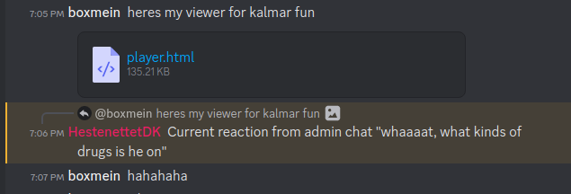

## Learnings

* Don't overthink it - we were about to cross reference Harry Potter spells
* Keep your old code around - my renderer was [based on a 2014 project](https://github.com/boxmein/website/blob/master/experiments/point-cloud/index.html) which really sped up the prototyping

* Live for this moment:

## Writeup

* We found a bunch of data of a rumored accelerometer
* My first instinct was to render it
  * Maybe my first instinct should've been to make a [kalman filter](https://boxmein.github.io/posts/2017-06-04-using-extended-kalman-filters-for-object-tracking/) to smooth out
    the true position...
* I rendered it
* It was really painful to watch
* 2.5 hours before the end of the CTF I made a [3-axis + orbital renderer](https://boxmein.github.io/2023/03/kalmarctf-kalmarunionen-fun/player.html)
* Likely if it would've clicked for us to just view it as 1s and 0s we would've got the flag 
 
